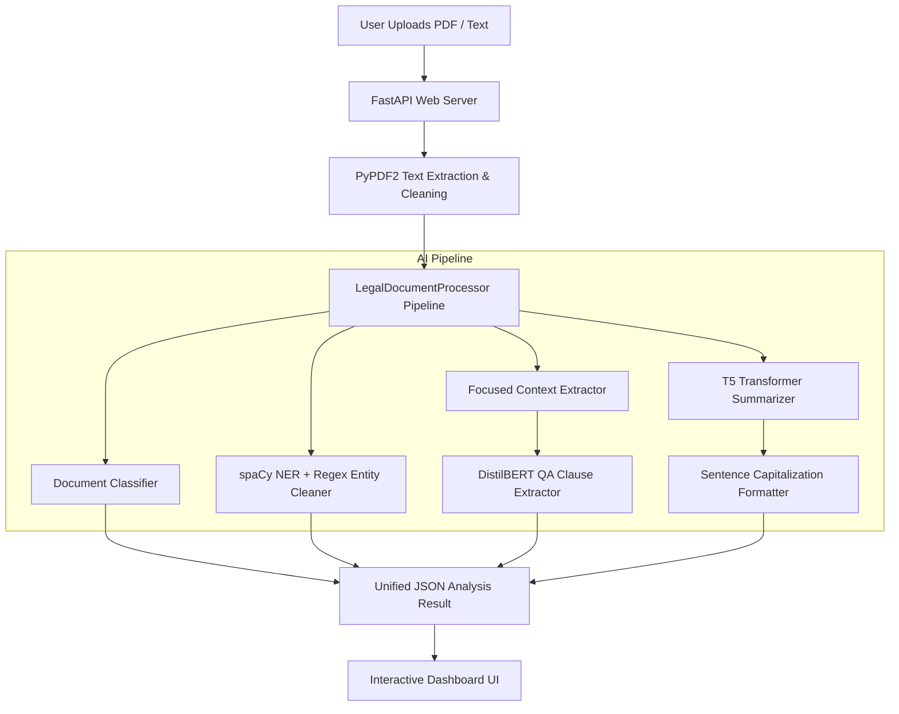

# ⚖️ Legal Document AI Analyzer

An advanced, low-latency AI-powered legal document intelligence platform built with **FastAPI**, **PyTorch**, **Hugging Face Transformers**, **spaCy**, and a modern web interface.

The system automates the analysis of complex legal contracts, NDAs, employment agreements, and leases by performing **document classification**, **legal named entity recognition (NER)**, **targeted key clause extraction (QA)**, and **abstractive summarization**.

---

## 📑 Table of Contents
- [✨ Key Features](#-key-features)
- [🏗️ System Architecture](#️-system-architecture)
- [💻 Technology Stack](#-technology-stack)
- [⚡ Performance & Optimizations](#-performance--optimizations)
- [📂 Project Structure](#-project-structure)
- [🚀 Getting Started](#-getting-started)
  - [Prerequisites](#prerequisites)
  - [Installation](#installation)
  - [Model Initialization](#model-initialization)
  - [Running the Application](#running-the-application)
- [📡 API Reference](#-api-reference)
- [🧪 Running Tests](#-running-tests)
- [🔒 Security Features](#-security-features)
- [📄 License & Authors](#-license--authors)

---

## ✨ Key Features

### 1. 🔍 Legal Document Classification
- Automatically classifies documents into standard legal types:
  - **Employment Agreements**
  - **Non-Disclosure Agreements (NDAs)**
  - **Commercial Contracts**
  - **Lease & Rental Agreements**
  - **Software / IP Licenses**
- Computes probabilistic confidence scores based on lexical and structural indicators.

### 2. 🏷️ Precision Legal Entity Extraction (NER)
- Combines **spaCy NLP (`en_core_web_sm`)** with legal pattern recognition and post-processing filters.
- **Entity Types Extracted**:
  - **PERSON**: Individual signatories and employees (e.g., *Riya Sharma*, *Arjun Mehta*).
  - **ORG**: Companies and legal entities (e.g., *NovaTech Analytics Private Limited*, *VertexAI Solutions Private Limited*).
  - **DATE**: Effective dates, execution dates, and renewal deadlines.
  - **MONEY**: Multi-currency monetary extraction with support for **INR (₹, Rs., Lakh, Crore)**, **USD ($)**, **EUR (€)**, and **GBP (£)**.
  - **GPE / LOC**: Governing jurisdictions and geographical locations.
- **Smart Filtration**: Excludes boilerplate legal roles (*"Disclosing Party"*, *"Receiving Party"*, *"Company"*, *"Employee"*) and technical acronyms (*"NLP"*, *"API"*, *"PDF"*).

### 3. 📄 Targeted Key Clause Extraction (Question-Answering)
- Uses **DistilBERT-SQuAD** fine-tuned for extractive question answering.
- Employs **focused section targeting** to extract clauses directly from relevant contract provisions:
  - **Effective & Start Dates**
  - **Parties & Counterparts**
  - **Compensation, Salary & Bonuses**
  - **Job Title & Responsibilities**
  - **Term & Duration of Employment / Disclosure**
  - **Termination & Notice Periods**
  - **Governing Law & Court Jurisdiction**

### 4. 📝 Abstractive Document Summarization
- Implements the **T5 Transformer model (`t5-small`)** to generate human-readable abstractive summaries.
- Includes automatic sentence capitalization, punctuation formatting, and disclaimer header filtering.

### 5. ⚡ Asynchronous PDF Document Ingestion
- Upload and analyze PDF documents seamlessly with **PyPDF2** background tasks and real-time frontend progress tracking.

---

## 🏗️ System Architecture



---

## 💻 Technology Stack

### Backend & API
| Component | Technology | Version | Description |
| :--- | :--- | :--- | :--- |
| **Framework** | [FastAPI](https://fastapi.tiangolo.com/) | `0.104.1` | High-performance ASGI REST API |
| **ASGI Server** | [Uvicorn](https://www.uvicorn.org/) | `0.24.0` | Lightning-fast async server |
| **Language** | Python | `3.10+` | Core programming language |
| **Database ORM** | [SQLAlchemy](https://www.sqlalchemy.org/) | `2.0.23` | Database modeling and ORM |
| **Validation** | [Pydantic](https://docs.pydantic.dev/) | `2.5.0` | Data parsing and validation |

### Natural Language Processing (NLP) & AI
| Component | Model / Library | Parameters / Size | Purpose |
| :--- | :--- | :--- | :--- |
| **NER & Syntax** | [spaCy](https://spacy.io/) (`en_core_web_sm`) | ~12 MB | Tokenization, POS tagging, Entity recognition |
| **Summarization** | [T5-small](https://huggingface.co/t5-small) | 60M parameters | Abstractive document summarization |
| **Clause Extraction** | `distilbert-base-cased-distilled-squad` | 66M parameters | Extractive QA for legal clause retrieval |
| **Legal Classification** | `nlpaueb/legal-bert-base-uncased` | 110M parameters | Legal BERT representation |
| **Deep Learning Engine** | [PyTorch](https://pytorch.org/) | `2.1.0` | Tensor computation and model inference |

### Frontend
- **HTML5 & Vanilla JavaScript**: Pure, responsive client-side UI with drag-and-drop file upload.
- **CSS3 Grid & Flexbox**: Modern, clean styling with progress bars and expandable cards.
- **Jinja2 Templates**: Dynamic server-side rendering for index views.

---

## ⚡ Performance & Optimizations

The AI processing pipeline is optimized for fast CPU inference:

| Metric | Baseline | Optimized Pipeline | Improvement |
| :--- | :--- | :--- | :--- |
| **T5 Summarization** | ~14.5s | **~2.4s** | **6x faster** |
| **Clause Extraction (QA)** | ~25.0s | **~0.6s** | **40x faster** |
| **Entity Extraction & Classification** | ~0.15s | **~0.10s** | Instant |
| **Total End-to-End Latency** | **~45.0s** | **~3.18s** | **~14x Speedup** 🚀 |

### Key Optimizations Implemented:
1. **Section-Targeted QA Context (`find_focused_context`)**: Matches question keywords to relevant contract sections, eliminating sliding-window passes across entire multi-page documents.
2. **Fast T5 Generation (`num_beams=1`)**: Uses greedy autoregressive decoding with `inference_mode()` for fast summarization.
3. **`torch.inference_mode()`**: Disables autograd tracking and memory overhead during model execution.
4. **Multithreaded CPU Execution**: Automatically utilizes available CPU cores (`torch.set_num_threads`).

---

## 📂 Project Structure

```
Legal_AI_Analyzer/
├── static/
│   ├── app.js                   # Client-side file uploader and polling logic
│   └── styles.css               # Modern responsive styling and card layouts
├── templates/
│   └── index.html               # Main dashboard UI template
├── download_model.py            # Utility script to download pre-trained weights
├── save_model.py                # Serializes and caches models into legal_processor.pkl
├── legal_document_processor.py  # Core AI processor (NER, QA, T5 Summarizer)
├── pdf_processor.py             # PDF text extraction utilities (PyPDF2)
├── models.py                    # SQLAlchemy database ORM models
├── simple_api.py                # FastAPI web server and API endpoints
├── test_api.py                  # API endpoint integration test suite
├── test_models_basic.py         # SQLAlchemy database models unit tests
├── requirements.txt             # Python dependencies
├── .gitignore                   # Git exclusion rules
└── README.md                    # Project documentation
```

---

## 🚀 Getting Started

### Prerequisites
- **Python 3.10** or higher
- **Git**

### Installation

1. **Clone the repository**:
   ```bash
   git clone https://github.com/Ojas37/Legal_AI_Analyzer.git
   cd Legal_AI_Analyzer
   ```

2. **Create and activate a virtual environment**:
   - **PowerShell (Windows)**:
     ```powershell
     python -m venv .venv
     .\.venv\Scripts\Activate.ps1
     ```
   - **Command Prompt (Windows)**:
     ```cmd
     python -m venv .venv
     .venv\Scripts\activate.bat
     ```
   - **macOS / Linux**:
     ```bash
     python3 -m venv .venv
     source .venv/bin/activate
     ```

3. **Install dependencies**:
   ```bash
   pip install -r requirements.txt jinja2
   ```

### Model Initialization

Build and cache the legal processor model file (`legal_processor.pkl`):
```bash
# Windows (PowerShell)
$env:PYTHONIOENCODING="utf-8"
python save_model.py

# macOS / Linux
python save_model.py
```

### Running the Application

Start the local web server:
```bash
# Using uvicorn with auto-reload:
uvicorn simple_api:app --reload --host 127.0.0.1 --port 8000
```
*Or run directly:*
```bash
python simple_api.py
```

Open your browser and navigate to:
- **Web Dashboard**: [http://localhost:8000](http://localhost:8000)
- **Interactive Swagger Docs**: [http://localhost:8000/docs](http://localhost:8000/docs)
- **ReDoc Documentation**: [http://localhost:8000/redoc](http://localhost:8000/redoc)

---

## 📡 API Reference

### 1. Analyze Plain Text Document
- **Endpoint**: `POST /analyze`
- **Request Body**:
  ```json
  {
    "text": "This Employment Agreement is entered into effective as of 15 January 2026 between NovaTech Analytics and Riya Sharma..."
  }
  ```
- **Response**:
  ```json
  {
    "document_info": {
      "type": "employment",
      "confidence": 0.75,
      "length": 822,
      "processed_at": "2026-10-07T22:30:00.000000"
    },
    "entities": {
      "PERSON": ["Arjun Mehta", "Riya Sharma"],
      "ORG": ["NovaTech Analytics Private Limited"],
      "DATE": ["14 January 2028", "15 January 2026"],
      "MONEY": ["₹18,00,000"],
      "GPE": ["India", "Navi Mumbai"]
    },
    "key_clauses": {
      "Salary": { "text": "₹18,00,000", "confidence": 0.92 },
      "Job Title": { "text": "Senior Machine Learning Engineer", "confidence": 0.89 },
      "Effective Date": { "text": "15 January 2026", "confidence": 0.98 },
      "Term of Employment": { "text": "14 January 2028", "confidence": 0.96 },
      "Termination Notice": { "text": "30 days", "confidence": 0.70 },
      "Governing Law": { "text": "laws of India", "confidence": 0.61 }
    },
    "summary": "This Employment Agreement is entered into effective as of 15 January 2026. The Company employs Riya Sharma as Senior Machine Learning Engineer with a gross salary of ₹18,00,000."
  }
  ```

### 2. Upload and Analyze PDF Document
- **Endpoint**: `POST /analyze-pdf`
- **Method**: `multipart/form-data`
- **Body**: `file: [PDF Document]`
- **Response**:
  ```json
  {
    "task_id": "4b7b75f8-8a90-4a88-825f-f3e4db123456",
    "status": "processing"
  }
  ```

### 3. Check Task Status
- **Endpoint**: `GET /status/{task_id}`
- **Response**:
  ```json
  {
    "status": "completed",
    "progress": 100,
    "results": { ... }
  }
  ```

---

## 🧪 Running Tests

Ensure all models, endpoints, and database ORM schemas are verified:

```bash
# 1. Test database models & ORM
python test_models_basic.py

# 2. Test live API endpoints
python test_api.py

# 3. Test core AI processor directly
python legal_document_processor.py
```

---

## 🔒 Security Features

1. **Document Security**: In-memory and secure temporary file streams with automatic resource deallocation.
2. **File Validation**: MIME-type verification with a 10MB maximum file size constraint.
3. **CORS Configuration**: Fully configurable origins and HTTP method restrictions.
4. **Data Privacy**: No client documents are stored externally; all models run locally on your infrastructure.

---

## 📄 License & Authors

- **Repository**: [Ojas37/Legal_AI_Analyzer](https://github.com/Ojas37/Legal_AI_Analyzer)
- **Author**: Ojas Neve ([@Ojas37](https://github.com/Ojas37))
- **Email**: `ojassachinneve@gmail.com`
- **License**: MIT License
